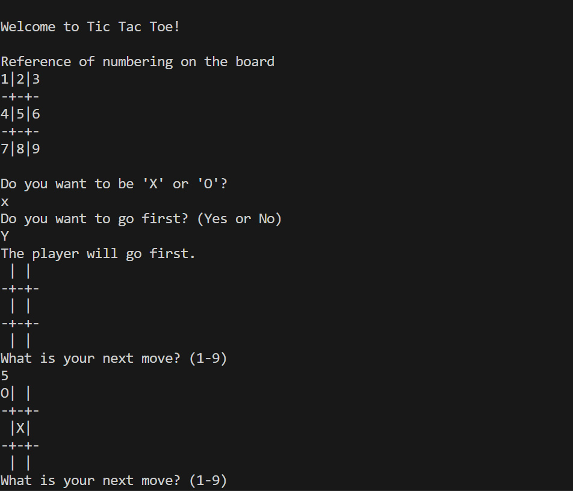
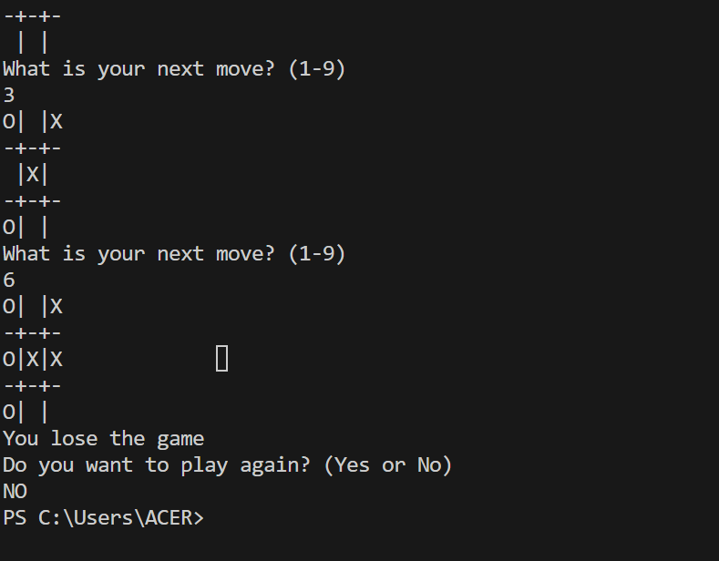

# Tic-Tac-Toe (Unbeatable AI)

A command-line Tic-Tac-Toe game where the computer opponent uses the **minimax algorithm with
alpha-beta pruning** — it never loses. You can play first or second, as X or O.

## How it works

Minimax explores the full game tree from the current board: it recursively tries every legal move,
scores terminal states (+10 for a computer win, -10 for a player win, 0 for a tie, adjusted by
search depth so it prefers winning sooner and losing later), and picks the move that maximizes its
guaranteed outcome assuming the opponent also plays optimally. Alpha-beta pruning cuts off branches
that can't affect the final decision, which keeps the search fast even though Tic-Tac-Toe's tree is
small enough that pruning isn't strictly necessary here.

## Run it

```bash
python tic_tac_toe.py
```

You'll be asked whether to play as X or O and whether to move first.

<p align="center">
  
  
</p>

## Tech

Pure Python, no dependencies.
